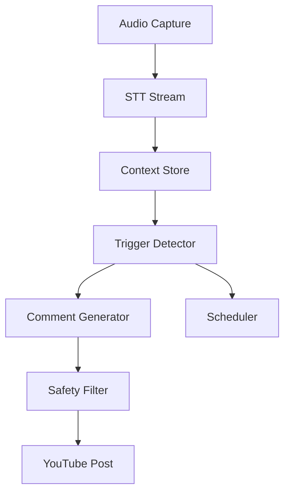

# Design Document

## Overview

Next.js（Vercel）で設定UI、ローカルエージェント（macOS,
Node.js/TS）で音声→STT→検知→生成→安全→YouTube投稿（A案）。

## Steering Document Alignment

### Technical Standards (tech.md)

- TypeScript strict、UIはTailwind/Radix/shadcn、外部APIはサーバーサイドのみ

### Project Structure (structure.md)

- `packages/{agent,web,shared}` のモノレポ構成

## Code Reuse Analysis

### Existing Components to Leverage

- 共有型/スキーマ（`packages/shared`）
- Next.js Server Actions/Route Handlers

### Integration Points

- YouTube Data API v3（`liveChatMessages.insert`）
- STT/モデレーションAPI（プロバイダ切替）

## Architecture

- レイヤード＋ポート&アダプタ（Hexagonal）
- UI: 設定編集/配布（秘密/トークンは保存しない）
- ローカル: 実処理・投稿（OAuthトークンはローカルのみ）

### Modular Design Principles

- 単一責務/分割/疎結合/DI

## Components and Interfaces

### Component 1: STT Stream

- Purpose: 日本語ストリーミング認識
- Interfaces: `SpeechToTextPort`
- Dependencies: STT SDK（選択式）

### Component 2: YouTube Adapter

- Purpose: 投稿/レート/バックオフ
- Interfaces: `ChatPlatformPort`
- Dependencies: Google APIs client

## Data Models

- TranscriptSegment/ContextSummary/TriggerDecision/GeneratedComment/ModerationResult/PostResult（厳格型）

## Error Handling

### Error Scenarios

1. STT切断 → 自動再接続＋最小限ログ
2. 投稿429/5xx → 指数バックオフ＋上限

## Testing Strategy

### Unit Testing

- 機会検知/生成/安全/投稿

### Integration Testing

- STT→検知→生成→安全→投稿（外部モック）

### End-to-End Testing

- CLI起動〜停止、設定同期
