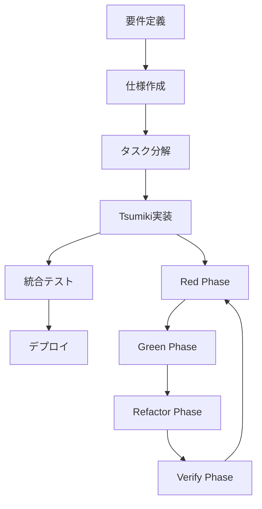

# 開発フロー

## 全体の流れ



## 1. 要件定義から仕様作成

### spec-workflowの活用

```bash
# MCPサーバーの起動
npx @pimzino/spec-workflow-mcp@latest . --AutoStartDashboard

# ダッシュボードにアクセス
open http://localhost:3456
```

### 仕様の構成

```
.spec-workflow/specs/comment-bot/
├── requirements.md    # 機能要件・非機能要件
├── design.md         # アーキテクチャ・設計
└── tasks.md          # 実装タスクリスト
```

## 2. Tsumiki実装サイクル

### Red Phase（テスト作成）

```typescript
// 1. インターフェースの定義
interface CommentGenerator {
  generate(context: Context): Promise<Comment>;
}

// 2. テストケースの作成
describe('CommentGenerator', () => {
  it('should generate contextual comment', async () => {
    const generator = new CommentGenerator();
    const context = {
      recentTranscript: ['面白い話ですね'],
      keywords: ['プログラミング', 'AI']
    };
    
    const comment = await generator.generate(context);
    
    expect(comment.content).toContain('プログラミング');
    expect(comment.confidence).toBeGreaterThan(0.5);
  });
});
```

### Green Phase（最小実装）

```typescript
// 3. テストをパスする実装
export class CommentGenerator {
  async generate(context: Context): Promise<Comment> {
    // 最小限の実装
    const keyword = context.keywords[0];
    return {
      content: `${keyword}について興味深いですね！`,
      confidence: 0.8
    };
  }
}
```

### Refactor Phase（改善）

```typescript
// 4. 品質向上
export class CommentGenerator {
  constructor(
    private llm: LLMPort,
    private policy: CommentPolicy
  ) {}

  async generate(context: Context): Promise<Comment> {
    try {
      // プロンプト構築
      const prompt = this.buildPrompt(context);
      
      // LLM呼び出し
      const response = await this.llm.generate(prompt);
      
      // ポリシー適用
      const validated = await this.policy.validate(response);
      
      return {
        content: validated.content,
        confidence: validated.confidence,
        metadata: {
          generatedAt: new Date(),
          context: context.keywords
        }
      };
    } catch (error) {
      return this.generateFallback(context);
    }
  }

  private buildPrompt(context: Context): string {
    // プロンプトテンプレート使用
    return `...`;
  }

  private generateFallback(context: Context): Comment {
    // エラー時のフォールバック
    return {
      content: 'なるほど！',
      confidence: 0.3
    };
  }
}
```

### Verify Phase（品質確認）

```bash
# 5. 品質チェックリスト

# ✅ テスト
npm test -- --coverage

# ✅ 型チェック
npm run type-check

# ✅ リント
npm run lint

# ✅ 統合テスト
npm run test:integration

# ✅ ドキュメント更新
npm run docs:check
```

## 3. ブランチ戦略

### GitFlowベース

```bash
main
├── develop
│   ├── feature/comment-generation
│   ├── feature/safety-filter
│   └── feature/web-ui
├── release/v1.0.0
└── hotfix/critical-bug
```

### ブランチ命名規則

- `feature/`: 新機能
- `fix/`: バグ修正
- `refactor/`: リファクタリング
- `docs/`: ドキュメント
- `test/`: テスト追加・修正

### コミットメッセージ

```bash
# 形式
<type>(<scope>): <subject>

# 例
feat(agent): コメント生成ロジックの実装
fix(web): 設定画面のバリデーションエラー修正
docs(readme): セットアップ手順の更新
test(safety): NGワードフィルタのテスト追加
```

## 4. CI/CDパイプライン

### GitHub Actions

```yaml
name: CI
on: [push, pull_request]

jobs:
  test:
    runs-on: ubuntu-latest
    steps:
      - uses: actions/checkout@v3
      - uses: actions/setup-node@v3
      - run: npm ci
      - run: npm test
      - run: npm run lint
      - run: npm run type-check
      
  deploy:
    needs: test
    if: github.ref == 'refs/heads/main'
    runs-on: ubuntu-latest
    steps:
      - run: npm run deploy
```

### 品質ゲート

- テストカバレッジ: 80%以上
- 型エラー: 0
- リントエラー: 0
- セキュリティ脆弱性: 0

## 5. レビュープロセス

### プルリクエストテンプレート

```markdown
## 概要
<!-- 変更の概要を記載 -->

## 変更内容
- [ ] 機能追加
- [ ] バグ修正
- [ ] リファクタリング
- [ ] ドキュメント

## テスト
- [ ] 単体テスト追加/更新
- [ ] 統合テスト実施
- [ ] 手動テスト完了

## チェックリスト
- [ ] Tsumiki方式に従った実装
- [ ] ドキュメント更新
- [ ] 破壊的変更なし
```

### レビューポイント

1. **コードの品質**
   - 可読性
   - 保守性
   - パフォーマンス

2. **テストの充実度**
   - エッジケース
   - エラーハンドリング
   - モックの適切性

3. **設計の妥当性**
   - SOLID原則
   - DRY原則
   - YAGNI原則

## 6. リリースプロセス

### セマンティックバージョニング

```
v<major>.<minor>.<patch>

major: 破壊的変更
minor: 機能追加
patch: バグ修正
```

### リリース手順

1. **リリースブランチ作成**
   ```bash
   git checkout -b release/v1.0.0
   ```

2. **バージョン更新**
   ```bash
   npm version minor
   ```

3. **リリースノート作成**
   ```bash
   npm run changelog
   ```

4. **タグ付け**
   ```bash
   git tag v1.0.0
   git push origin v1.0.0
   ```

5. **デプロイ**
   ```bash
   npm run deploy:production
   ```

## 7. トラブルシューティング

### よくある問題と解決策

#### ビルドエラー

```bash
# キャッシュクリア
npm run clean
npm install

# 型定義の再生成
npm run generate:types
```

#### テスト失敗

```bash
# 特定のテストをデバッグ
npm test -- --testNamePattern="failing test" --verbose

# スナップショット更新
npm test -- -u
```

#### 依存関係の問題

```bash
# 依存関係の確認
npm ls <package-name>

# 脆弱性チェック
npm audit

# 修正
npm audit fix
```

## まとめ

効率的な開発フローのポイント：

1. **仕様駆動開発**: spec-workflowで仕様を管理
2. **品質重視**: Tsumiki方式でテストファースト
3. **自動化**: CI/CDで品質を担保
4. **協調作業**: レビューとドキュメント重視

このフローに従うことで、高品質なソフトウェアを継続的に開発できます。
